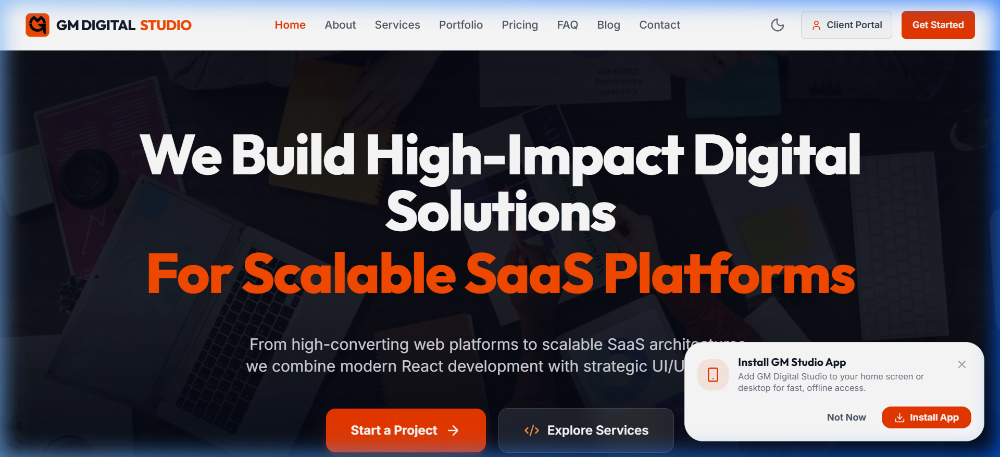
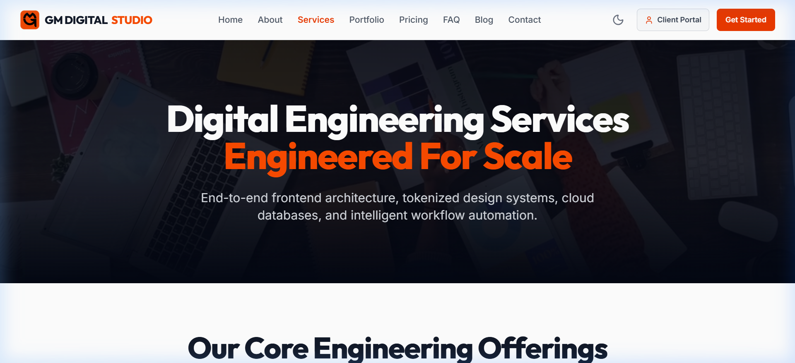
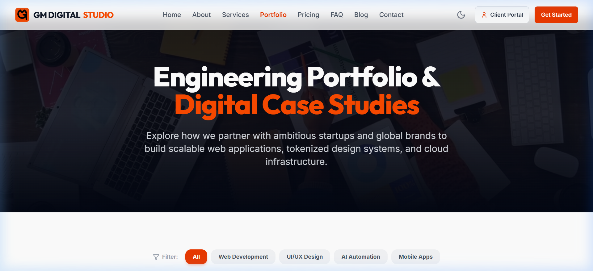
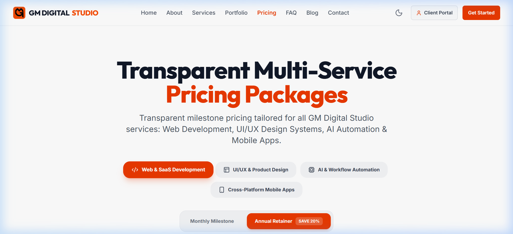
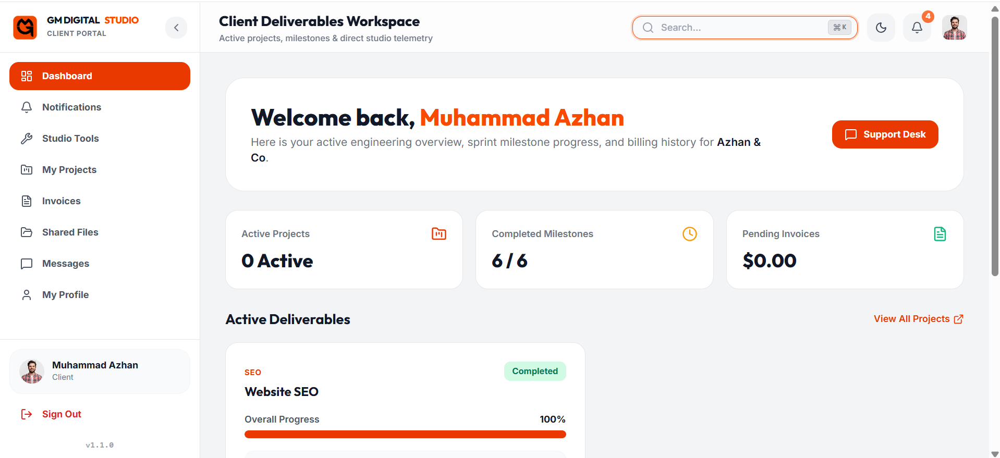
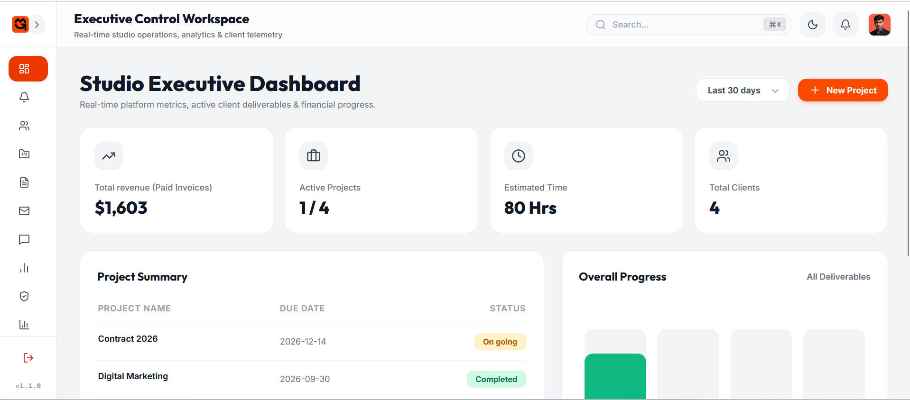

# 🚀 GM Digital Studio

> **Full-Stack Digital Agency Platform & Client SaaS Portal**  
> An enterprise-grade agency management platform featuring a high-impact public studio website, real-time client management portal, admin analytics dashboard, interactive SaaS studio tools, and serverless Edge Functions.

---

## 🌟 Overview

**GM Digital Studio** is a full-featured digital agency platform designed for modern creative agencies and software studios. It unifies public service marketing, client project tracking, milestone evaluation, financial invoicing, real-time messaging, and automated digital production tools in one cohesive platform.

---

## 📸 Platform UI Showcase

### 🌐 Public Agency Showcase
| Home Landing Experience | Agency Services Matrix |
| :---: | :---: |
|  |  |

| Bento Portfolio & Case Studies | Tiered Service Pricing |
| :---: | :---: |
|  |  |

### 🛡️ Client Portal & Studio Management
| Client Deliverables Workspace | Studio Executive Dashboard |
| :---: | :---: |
|  |  |

---

## ✨ Core Features & Modules

### 🌐 1. Public Agency Showcase
* **High-Impact UI**: Vibrant dark themes, glassmorphic card layouts, smooth micro-animations, and fluid responsive design across all breakpoints.
* **Services & Portfolio Gallery**: Interactive service offerings with bento-grid case studies and detailed project overviews.
* **Multi-Service Pricing Matrix**: Feature comparison tables categorized per agency service line.
* **Engineering Blog & FAQ**: Category-filtered knowledge base with real-time article search and collapsible accordions.
* **Interactive Contact Portal**: Public lead generation form equipped with anti-automation bot protection and transactional email integration.

### 🛡️ 2. Studio Admin Dashboard
* **Executive Overview**: Financial revenue metrics, deliverable completion rates, and real-time activity logs.
* **Client & Project Management**: Provision client accounts, configure SaaS studio tool permissions, and assign milestone deliverables.
* **Milestone Progress Evaluator**: Interactive deliverable status evaluator with automatic progress percentage calculation.
* **Payment Proof Inspector**: Review uploaded client payment receipts with zoom and manual verification tools.
* **Executive Telemetry & Reports**: Export 300 DPI print-ready A4 PDF statements and raw CSV data logs.
* **Real-time Studio Messaging**: Admin-to-client inbox with client profile photo rendering.

### 💼 3. Client Portal
* **Project Workspace**: Real-time deliverable phase tracking, milestone status reviews, and direct client feedback submission.
* **SaaS Studio Tools Catalog**: Access unlocked agency automation tools (e.g. AI Carousel Maker with curated image integration).
* **Invoices & Billing Hub**: View itemized invoices, download formal PDF receipts, and upload payment receipts for studio verification.
* **Direct Studio Support**: Instant communication with studio administrators.
* **Shared Cloud Workspaces**: Direct access to assigned project workspace directories.

---

## 🛠️ Technology Stack

| Layer | Technology |
| :--- | :--- |
| **Core Framework** | React 18 + TypeScript + Vite |
| **Styling & UI** | Vanilla CSS + Tailwind CSS + Framer Motion |
| **Icons & Media** | Lucide React + HTML5 Ambient Video |
| **State Management** | React Context + TanStack Query |
| **Backend & Database** | Supabase (PostgreSQL, Realtime, Storage, RLS) |
| **Serverless Engine** | Supabase Edge Functions (Deno + TypeScript) |
| **Email Service** | Resend API (Transactional Client & Admin Emails) |
| **Telemetry & PDF** | jsPDF + html2canvas + Recharts |
| **App Standard** | W3C Progressive Web App (PWA) |

---

## 🔒 Security & Data Protection Highlights

* **Server-Side Data Isolation**: Queries strictly enforce exact client identification to prevent unauthorized cross-client data access.
* **Serverless API Proxying**: Third-party API requests execute server-to-server via Edge Functions without exposing API credentials to client browsers.
* **Anti-Bot Spam Protection**: Integrated invisible honeypot safeguards on public input forms to reject automated spam.
* **Strict CORS Controls**: Serverless functions strictly validate requesting origins against authorized studio subdomains.
* **Role Verification**: Admin endpoints verify authenticated JWT session metadata to prevent role spoofing.

---

## 📱 Progressive Web App (PWA)

Built as a fully compliant Progressive Web App:
- **Offline Caching**: Static assets cached via Workbox Service Worker.
- **Adaptive App Launcher**: Edge-to-edge brand icons optimized for Mobile Home Screens and Desktop Taskbars.
- **Native Installability**: Prompts users to install as a standalone application.

---

## 📄 License & Credits

Designed and developed by **Ghulam Murtaza** as a full-stack digital agency platform.

© 2026 **GM Digital Studio**. All rights reserved.
